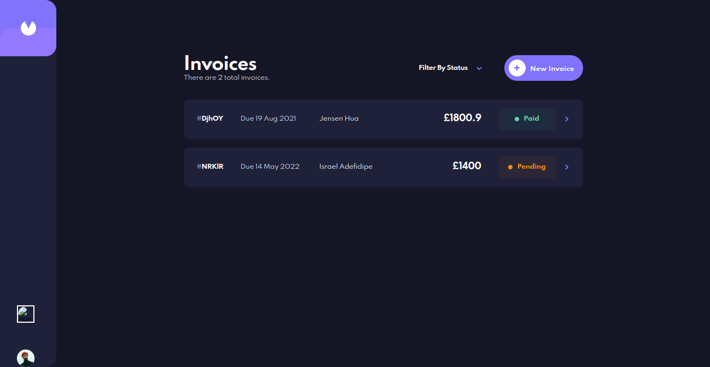

# Frontend Mentor - Invoice app solution

This is a solution to the [Invoice app challenge on Frontend Mentor](https://www.frontendmentor.io/challenges/invoice-app-i7KaLTQjl). Frontend Mentor challenges help you improve your coding skills by building realistic projects.

## Table of contents

- [Frontend Mentor - Invoice app solution](#frontend-mentor---invoice-app-solution)
  - [Table of contents](#table-of-contents)
  - [Overview](#overview)
    - [Intro](#intro)
    - [The challenge](#the-challenge)
    - [Screenshot](#screenshot)
    - [Links](#links)
  - [My process](#my-process)
    - [Built with](#built-with)
    - [What I learned](#what-i-learned)
    - [Continued development](#continued-development)
  - [Author](#author)
  - [Acknowledgments](#acknowledgments)

**Note: Delete this note and update the table of contents based on what sections you keep.**

## Overview

### Intro
 Hi, there!
 
 Thank you for checking out my solution to the  [invoice app challenge](https://invoice-app-crud.vercel.app/) from Frontend Mentor. grinning

Feel free to look around and explore! 
share comments here [Linkedin Post](https://www.linkedin.com/posts/iadefidipe_invoices-0-frontend-mentor-activity-6921833013764890625-sK3A?utm_source=linkedin_share&utm_medium=member_desktop_web)

### The challenge

Users should be able to:

- View the optimal layout for the app depending on their device's screen size
- See hover states for all interactive elements on the page
- Create, read, update, and delete invoices
- Receive form validations when trying to create/edit an invoice
- Save draft invoices, and mark pending invoices as paid
- Filter invoices by status (draft/pending/paid)
- Toggle light and dark mode
- **Bonus**: Keep track of any changes, even after refreshing the browser (`localStorage` could be used for this if you're not building out a full-stack app)

### Screenshot

### Links

- Solution URL: [Git Repo Link](https://github.com/iadefidipe/invoice-app)
- Live Site URL: [Live site URL ](https://invoice-app-crud.vercel.app/)

## My process

### Built with

- Semantic HTML5 markup
- CSS custom properties
- Flexbox
- CSS Grid
- Mobile-first workflow
- [React](https://reactjs.org/) - JS library
- [Next.js](https://nextjs.org/) - React framework
- [Styled Components](https://styled-components.com/) - For styles
- [Typescript](https://www.typescriptlang.org/)- Typescript Documentation
- [Redux Toolkit](https://redux-toolkit.js.org/)- Redux Library
- [Firebase](https://firebase.google.com/)- Firebase Firestore Database
- [Formik](https://formik.org/docs/overview)- Formik Form management Library
- [Framer Motion](https://www.framer.com/docs/) - Framer Motion Animation Library

### What I learned

This is my first time, using Typescript and most of the libraries I used on this Project, like formik, Firebase, Redux. So it was a challenging journey, with the way I scalled the app.

### Continued development

- There will be another version of this app. Where I will be developing the backend myself with NodeJs and Express Js, Because Firestore might shut down because I'm using a free plan.
- Implement features like Authentication and Authorization.

<!-- ### Useful resources

- [Example resource 1](https://www.example.com) - This helped me for XYZ reason. I really liked this pattern and will use it going forward.
- [Example resource 2](https://www.example.com) - This is an amazing article which helped me finally understand XYZ. I'd recommend it to anyone still learning this concept. -->

## Author

- Website - [Portfolio Website](https://iadefidipe.netlify.app/)
- Frontend Mentor - [@iadefidipe](https://www.frontendmentor.io/profile/iadefidipe)
- Twitter - [@iadecodes](https://www.twitter.com/iadecodes)

## Acknowledgments

This is where you can give a hat tip to anyone who helped you out on this project. Perhaps you worked in a team or got some inspiration from someone else's solution. This is the perfect place to give them some credit.

[Frontend Mentor](https://www.frontendmentor.io/)
